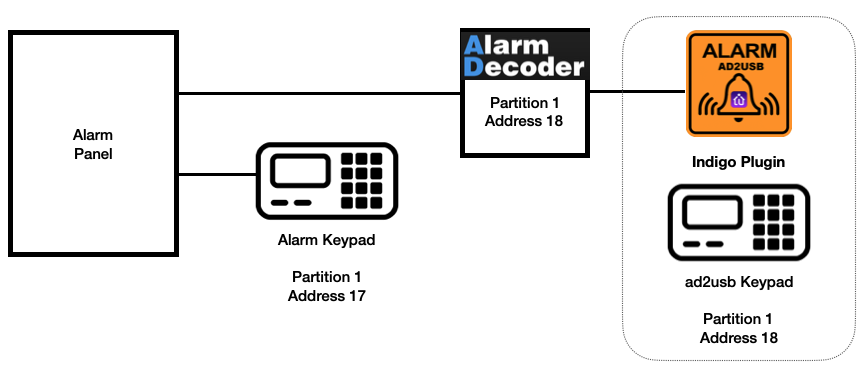
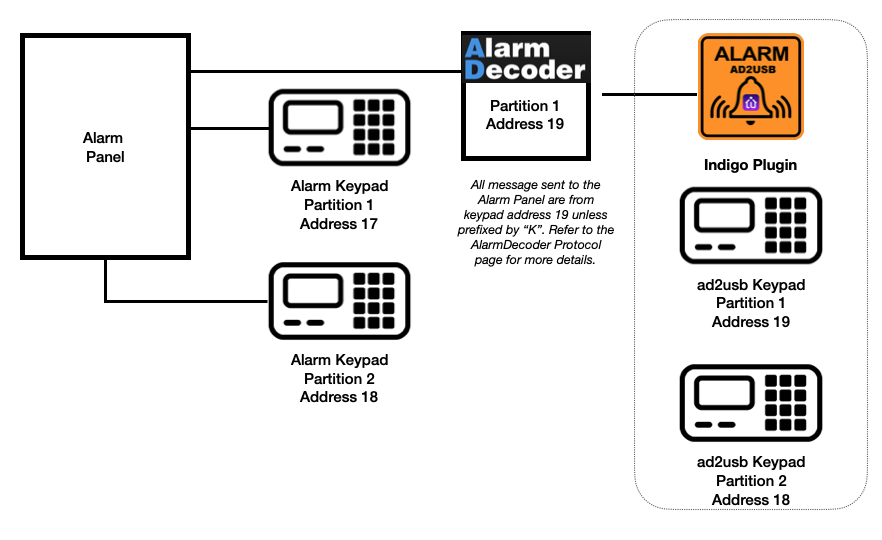

# ad2usb Indigo Plugin

## About
**ad2usb** is a plugin interface to the NuTech AD2* alarm system interface for Honeywell's Ademco Vista line of alarm panels. It allows you to create Indigo devices for each of your alarm panel's sensors (e.g. door sensor, motion sensor, window sensor, ...) which can then take advantage of many of Indigo's features available for devices. It also allows you to read and send alarm messages by emulating an alarm panel keypad. There are addition features described in this document.

## About "*TBP*" in this README
There are still several items marked "To Be Published" (*TBP*) in this document. Each subsequent release will attempt to replace these *TBP* sections with more complete documentation for the plugin.

## Required Hardware
This plugin requires both a [NuTech AlarmDecoder](https://www.alarmdecoder.com) (AD2) alarm interface and an alarm panel. Both the NuTech AD2USB and AD2Pi are supported (see Note 1). This interface supports a broad range of alarm panels manufactured by **Honeywell** and sold under the **ADEMCO VISTA** brand name and similar panels sold by First Alert. The list of supported panels includes (see Note 2):

- VISTA-4110XM
- VISTA-15P
- VISTA-20P
- VISTA-21IP
- VISTA-40
- VISTA-50P
- VISTA-128BPT/VISTA Turbo Series (see Note 3)
- VISTA-250BPT/VISTA Turbo Series (see Note 3)
- First Alert-FA148CP
- First Alert-FA148CPSIA
- First Alert-FA168CPS
- First Alert-FA168CPSSIA

A more complete list is available from NuTech on their website. While the NuTech AlarmDecoder AD2* interface also supports alarm panels sold by DSC, this plugin is not tested with those panels. Users with DSC panels should look at the DSC Alarm plugin.

**Important Notes** :
1. Requires AlarmDecoder firmware version 2.2a.8.8 or 2.2a.6. The Plugin may not start or run with any other version.
2. While the panels listed should work, the developer testing for each release is limited to only on a VISTA-20P. Leverage the [Indigo ad2usb User Forum](https://forums.indigodomo.com/viewtopic.php?f=22&t=7584) to ask other users about their experience with your specific alarm panel model. Since I can test any panel message, I may ask in the Support Forum for parts of your panel message log to test.

## Features

This plugin adds new Indigo options for **Devices**, **Actions**, and **Trigger Events**. See the [Indigo Overview](https://wiki.indigodomo.com/doku.php?id=indigo_2021.2_documentation:overview) for more information about Devices, Actions, and Triggers.

### Devices

The ad2usb plugin adds the following device options to Indigo.

Device Type | Description
----------- | -----------
ad2usb Keypad | The AlarmDecoder Keypad emulator. You must add at least one and can have as many Indigo ad2usb Keypad devices as there are partitions. When selecting the keypad address for your ad2usb Keypad device, it must be a keypad address that is programmed in your alarm panel (this includes the NuTech AlarmDecoder device you programmed as a keypad). For systems with a single partition, the most common setup, you can only have one ad2usb keypad device and this device will be automatically set to the NuTech AlarmDecoder keypad address. Systems with multiple partitions can have multiple ad2usb keypad devices defined: one for each partition. However, the keypad address selected for all ad2usb Keypad devices **must exist** in the alarm panel programming. See the [ad2usb Keypad Addresses and Partitions](#ad2usb-keypad-addresses-and-partitions) section for some examples scenarios.   Keypads can have several states: Ready, Armed-Away, Armed-Stay, Armed-Max, Armed-Night (Night-Stay), and Fault. A Fault will display as the Keypad state when one or more Alarm Zone devices that are on the same partition as the Keypad become Faulted. One exception to this is if the Alarm Zone is Bypassed. When an Alarm Zone is Bypassed the Indigo UI icon for the Keypad and the bypassed Alarm Zone device will change to the Fault icon but the actual state will not change.
Alarm Zone | Standard alarm zone such as window or door sensors. Add one Indigo Alarm Zone device for each sensor you have configured with your alarm panel that you want to integrate with Indigo. Each Alarm Zone device has these three state variables with possible values shown in parenthesis: `zoneState` (Fault or Clear), `onOffState` (On or Off), and `bypassState` (On or Off). States `zoneState` and `onOffState` are somewhat redundant since when an alarm zone changes state both change. They exist so you can create triggers on any changes of the state name of your preference.  In Basic Mode zones faults are updated from AlarmDecoder's keypad messages. This should be fine for most users. In Advanced Mode zone faults are updated from Expander, Relay, or Wireless messages received by the AlarmDecoder.
Zone Group | Creates a group of Alarm Zones. This allows you to create a group of alarm zones devices that treated as single device within Indigo Triggers. Zone groups have the same states as Alarm Zones with the exception they do not have the `bypassState`. Zone Groups change to Fault (or On) when **ANY** of their Zone's change from Clear to Fault (or Off to On). Zone Groups change to Clear (or Off) once **ALL** of their Zones are Clear (or Off).
Indigo Managed Virtual Zone | The AlarmDecoder's Zone Expander Emulation feature allows the AlarmDecoder to act in place of a physical expander board and make use of virtual zones with your panel. After enabling it on both the alarm panel and the AlarmDecoder you can begin opening and closing zones, which will be relayed back to the panel. [See the AlarmDecoder Protocol Documentation for more details.](https://www.alarmdecoder.com/wiki/index.php/Protocol#Zone_Emulation). You can create an Indigo Managed Virtual Zone to use this capability. After creating the Indigo Managed Virtual Zone, you call a specific Action, "Change a Virtual Zone's state", which will change the state of the device in Indigo and send Open or Close messages to your alarm panel. **CAUTION**: Do not set a trigger on a Virtual Zone's device change to call the "Change a Virtual Zone's state" or you will have an infinite loop. See the "Alarm Zone Actions" section.

### ad2usb Keypad Addresses and Partitions

The table and diagrams below offer several examples of how NuTech AlarmDecoder and Indigo ad2usb Keypad devices can be configured. The Keypad Addresses shown below are just examples. Refer to your alarm panel programming guide to determine how to review what keypads are already defined on your alarm panel and their partition numbers and addresses.

Number of Partitions | NuTech AlarmDecoder Keypad Address and Partition | ad2usb Keypad Device Address and Partition |
-------------------- | ------------------------------------------------ | -------------------- |
1 | The AlarmDecoder has a default keypad address value of 18 but other values may be selected during the alarm panel programming. The keypad partition number programmed on the alarm panel has to be 1 for a single partition system. | Only Partition 1 will be available when configuring the device. Only one ad2usb Keypad is allowed and the address will be automatically set to the same keypad address as the NuTech AlarmDecoder when the AlarmDecoder's CONFIG settings are read (ex: Partition 1, Keypad Address 18)
2 | NuTech AlarmDecoder programmed for Partition 1 and some available keypad address. | Two ad2usb Keypad devices can be created. An example setup could be:   First ad2usb Keypad device: set to partition 1 and a select the same keypad address as the NuTech AlarmDecoder (ex: Partition 1, Keypad Address 19).   Second ad2usb Keypad device: set to partition 2 and select an existing keypad address assigned to partition 2 (ex: Partition 2, Keypad Address 18).
2 | NuTech AlarmDecoder programmed for Partition 2 and an available keypad address. | Two ad2usb Keypad devices can be created. An example setup could be:   First ad2usb Keypad device: set to partition 1 and a select an existing keypad address assigned to partition 1 (ex: Partition 1, Keypad Address 17).   Second ad2usb Keypad device set to partition 2 and a select the same keypad address as the NuTech AlarmDecoder (ex: Partition 2, Keypad Address 19).
3 or more | NuTech AlarmDecoder programmed for Partition 1, or 2, or any valid partition and an available keypad address. | Example setup would be one ad2usb Keypad devices per partition:   One ad2usb Keypad device: set to the same partition and keypad address as the NuTech AlarmDecoder.   All other ad2usb Keypad devices: set to each of the remaining partitions and select a valid and programmed keypad address for that partition.

|  |
|:--:|
| Basic single partition and single ad2usb Keypad setup |

|  |
|:--:|
| Advanced multi-partition and multi-ad2usb Keypad setup |

### Bypass Rules for Indigo Devices

Indigo will behave the same as an alarm panel for Bypassed devices. The table below outlines Alarm Zone and Keypad devices behavior. These behaviors apply to Basic Mode only.

Alarm Zone Bypassed Status | Alarm Zone State | Indigo Alarm Zone Device State | Indigo Alarm Zone Device UI Display | Indigo Keypad Device State | Indigo Keypad Device UI Display | Additional Info
-------------------------- | ------------------ | ------------------------------ | ----------------------------------- | -------------------------- | ------------------------ | ---------------
Bypassed | Clear | Bypassed | Grey Icon | Clear | Green Icon | Indigo, like the Alarm panel, does not detect changes in the Alarm Zone device's state when Bypassed. The grey icon is shown instead of the green, indicating the Alarm Zone is device Bypassed.
Bypassed | Fault | Bypassed | Red Icon | Clear | Green Icon | Indigo, like the Alarm panel, does not detect changes in the Alarm Zone device's state when Bypassed. The Alarm Zone icon will change from grey to red when a Fault is detected on a bypassed zone, but the Keypad device will not recognize it as a Fault. The Alarm Zone Indigo device state will remain "Bypass", only the icon in the UI will change.
Not Bypassed | Clear | Clear | Green Icon | Clear | Green Icon | Both the Alarm Zone and Keypad Device will show Clear unless another Alarm Zone device on the same partition has Faulted. Keypad devices will Fault when **ANY** of their Alarm Zone devices Fault and are Clear when **ALL** of their devices are Clear.
Not Bypassed | Fault | Fault | Red Icon | Fault | Red Icon | When an Alarm Zone device change to Fault, the Keypad Device will also change to Fault for the Keypad Device that is on the same partition as the Alarm Zone device. If you have multiple partitions, Keypad Devices with a partition number different from the Alarm Zone will not change state based on Alarm Zone devices on other partitions.

### Actions

The ad2usb plugin adds several Actions for **ad2usb Keypad** and **Alarm Zone** devices.

#### Keypad Actions
You can use Indigo Actions to Arm & Disarm your panel and invoke panel events. Four types of Arm Actions are available. Refer to your Alarm Users Guide for description of each. You can also writes an arbitrary message to the panel via the keypad. By default panel messages are being sent ***from*** the keypad number and partition of the NuTech AlarmDecoder (e.g. Partition 1, Keypad address 18).  **CAUTION:** Having detailed knowledge of your alarm panel's operation is recommended before configuring the Write to Panel action.

Keypad Actions | Description (refer to you Alarm Panel Users Guide)
-------------- | -----------
Arm-Stay | Performs the keypad function STAY. Arms perimeter zones only and entry delay is on.
Arm-Instant | Performs the keypad function INSTANT. Same as STAY, except entry delay is off.
Arm-Away | Performs the keypad function AWAY. Arms the entire burglary system, perimeter and interior. Entry delay is on.
Arm-Max | Performs the keypad function MAX. Same as AWAY, except entry delay is off.
Write To Panel | Writes an arbitrary message to the panel via the keypad. By default panel messages are being sent ***from*** the keypad number and partition of the NuTech AlarmDecoder (e.g. Partition 1, Keypad address 18). You can prefix the message with 'K' to send the message from a specific keypad. See the [AlarmDecoder Protocol page](https://www.alarmdecoder.com/wiki/index.php/Protocol#Addressed_Message) for more details. **CAUTION:** Having detailed knowledge of your alarm panel's operation is recommended before configuring this action.

#### Alarm Zone Actions
Alarm Zone actions are less likely to be used but available since most Alarm Zone devices simply change state based on data being sent from your alarm panel.

Alarm Zone Actions | Description
------------------ | ----------
Force Alarm Zone state change | This Action can be called to force an Alarm Zone's state in Indigo to either Clear or Fault. The Indigo device state is changed but no messages are sent to the AlarmDecoder. It is provided for any special use cases that are needed; but in general is not needed for normal operation.
Change a Virtual Zone's state | Zone Expander Emulation allows the AlarmDecoder to act in place of a physical expander board and make use of virtual zones with your panel. After enabling it on both the panel and the AlarmDecoder you can begin opening and closing zones, which will be relayed back to the panel. This Action will send `Clear (Closed)` or `Faulted (Open)` to your alarm panel for defined zone. [See the AlarmDecoder Protocol Documentation for more details](https://www.alarmdecoder.com/wiki/index.php/Protocol#Zone_Emulation)

### Trigger Events

In addition to the ability to add Triggers for Indigo Device state changes, the ad2usb plugin can detect various alarm panel events that you can create Indigo triggers for. All of the Events listed below, except `Alarm Tripped: Countdown started`, require all of the following:
* Either a Long Range Radio or emulation of LRR via the AlarmDecoder
* Enabling of Long Range Radio (LRR) messages on your alarm panel
* Enabling of the respective reporting event on your alarm panel. For VISTA-15P and VISTA-20P refer to panel programming fields \*29 and \*59 through \*76 for the programming fields. Each of these fields is also listed below for each event.

#### Panel Arming Trigger Events
Event | Description | VISTA-15P and VISTA-20P Programming Fields |
----- | ----------- | --------- |
Armed Stay | Detect when your panel is set to Armed Stay | \*66
Armed Away | Detect when your panel is set to Armed Away | \*66
Disarmed | Detect when your panel is Disarmed | \*65 - also requires \*66 to be enabled

#### System Status Trigger Events
Event | Description | VISTA-15P and VISTA-20P Programming Fields |
----- | ----------- | --------- |
AC Power Loss | Indicates that AC power was lost to the alarm panel | \*62
AC Power Restore | Indicates that AC power was restored | \*73
Panel Battery Low | Alarm panel low battery indication | \*63
Panel Battery Restore | Alarm panel low battery indication | \*74
RF Battery Low | Low battery indication for the RF transmitter | \*67
RF Battery Restore | Low battery indication for the RF transmitter restored | \*75
Trouble| Indicates that a zone is reporting a tamper or failure |  \*60
Trouble Restore | Indicates that the trouble event was restored | \*71

#### Alarm Trigger Events
Event | Description | VISTA-15P and VISTA-20P Programming Fields |
----- | ----------- | --------- |
Panic Alarm | Indicates that there is a panic | ***TBD***
Fire Alarm | Indicates that there is a fire | ***TBD***
Audible Alarm |Indicates that an audible alarm is in progress |***TBD***
Silent Alarm | Indicates that there was a silent alarm | ***TBD***
Entry Alarm | Indicates that there was an entry alarm |***TBD***
Aux Alarm | Indicates that an auxiliary alarm type was triggered |***TBD***
Perimeter Alarm | Indicates that there was a perimeter alarm |***TBD***
Alarm Tripped: Countdown started | The alarm has been tripped and the countdown to Disarm has started | N/A - this event is detected from changes in the Keypad message

#### User Trigger Events
While similar to Panel Arming Events, with User events you can detect when a specific user ID you specify has initiated any these events: Disarmed, Armed Stay, or Armed Away. Note that if you have Triggers enabled for both a Panel Arming event and a User event both triggers will execute. For example if a Panel Disarmed Trigger is defined **AND** a User Trigger is defined for when user number 07 disarms the panel then when user 07 disarms the panel the **BOTH** of these triggers will execute. 

Event | Description | VISTA-15P and VISTA-20P Programming Fields |
----- | ----------- | --------- |
Armed Stay | Detect when your panel is set to Armed Stay | \*66
Armed Away | Detect when your panel is set to Armed Away | \*66
Disarmed | Detect when your panel is Disarmed | \*65 - also requires \*66 to be enabled

### Indigo Client UI
#### General
After you configure the plugin and add your alarm devices to Indigo, the Indigo Client UI will show alarm panel device zone states than alarm panel device address (i.e. the alarm zone number).
#### Device States
##### Clear and Fault
The Indigo Client UI will show the Clear or Fault state of the zone. The green circle icon represents Clear and the red circle icon represents Fault.
##### Bypass
When an Alarm Zone is set to Bypass = On it will display the generic Indigo "Sensor Off" icon (grey circle) and the text "Bypass" in the Indigo Client UI. Bypassed zones do not Fault on the panel and thus will not change state even if the sensor is tripped.

## Configuration and Setup

### General

#### Alarm Panel
You need to be familiar with how to program your Alarm panel to add a new keypad address. Refer to your Alarm panel programming guide on how to add a keypad device.

#### AlarmDecoder
You should familiarize yourself with the setup and configuration of your AlarmDecoder. See [NuTech's AlarmDecoder website](https://www.alarmdecoder.com/index.php) for details on how to install and configure your AlarmDecoder. This plugin can manage certain configuration parameters of your AlarmDecoder. Use the **AlarmDecoder Configuration** item from the Plugin's pull-down menu to view and change these settings. Only those AlarmDecoder configuration settings controlled by this plugin will be changed. Other AlarmDecoder configuration settings not managed by this plugin will not be changed. If you will be changing any AlarmDecoder configuration options not managed by this plugin (MASK or CONFIGBITS), it is recommended that you stop the plugin first and restart it after you have made your changes.

When using the **AlarmDecoder Configuration** menu, you should first use the "Read Config" button to read the AlarmDecoder's current settings. This button will log the current setting to the Indigo event log and update the **AlarmDecoder Configuration** dialog to match the current AlarmDecoder settings. Configuration settings managed by this plugin should be changed through the Plugin. The AlarmDecoder configuration settings managed by this plugin are below:
- ADDRESS - the keypad address
- EXP - Emulation of zone expanders 1-5
- REL - Emulation of relay expanders 1-4
- LRR - Emulation of Long Range Radio expander
- DEDUPLICATE - If enabled, removes duplicate alphanumeric keypad messages

#### Indigo Plugins
You should be familiar with installing and configuring Indigo plugins.See Indigo's [Managing Plugins](https://wiki.indigodomo.com/doku.php?id=indigo_2021.2_documentation:getting_started#managing_plugins) documentation for details on installing and upgrading plugins.

### Quick Start - First Install
1. Program your alarm panel to support the [NuTech AlarmDecoder](https://www.alarmdecoder.com/wiki/index.php/Panel_Configuration) as a new keypad device (default from NuTech is "18").
2. Install and configure your NuTech AlarmDecoder. Use a terminal program or other supported method to configure the AlarmDecoder per [NuTech's instructions](https://www.alarmdecoder.com/index.php). For network devices make sure you know the IP address and port (default is 10000) to communicate with the AlarmDecoder. If you're not going to use the default keypad address of "18" change it now. Advanced users should make any additional configuration changes to your AlarmDecoder. In most cases the default settings of the AlarmDecoder are fine and no additional configuration is needed. After this initial setup, many AlarmDecoder settings can be managed from within the plugin. See the [AlarmDecoder Configuration](#alarmdecoder-configuration) section of this document.
3. Download this plugin from the Indigo Plugin Store.
4. Double-click the plugin icon to install the plugin within Indigo. Choose "Install and Enable the Plugin"
5. Choose "AD2SUB Alarm Interface" from the Plugins menu and choose Configure. In many cases you will only need the minimum information the plugin needs to operate:
  - **AD2USB connection settings**: Configure the IP address and port **OR** the USB Serial settings of your AlarmDecoder so the plugin knows how to connect to your AlarmDecoder.
  - **Number of Partitions**: If you have more than one (1) alarm partition change the default of "1" to the number of partitions you have. If you are unsure, leave the setting as "1" partition.
6. Save the Configuration.
7. Add a Keypad Device with the same keypad address as the NuTech AlarmDecoder.
8. Add Zone Devices.

### Quick Start - Upgrading the ad2usb plugin
1. Refer to Indigo's [Plugins Menu](https://wiki.indigodomo.com/doku.php?id=indigo_2021.2_documentation:getting_started#plugin_menus_in_indigo) documentation.
2. Go to Indigo's Plugins -> Manage Plugins menu
3. Look to see if ad2usb plugin has an upgrade and if it is compatible with your version of Indigo. If it has an upgrade:
  - Disable the ad2usb plugin
  - Download the latest version of the plugin if it is compatible with your version of Indigo
  - In the MacOS Finder, double-click on the downloaded plugin. Choose "Install and Enable"
  - Verify the new version of the plugin is running via the Plugins -> Manage Plugins menu. The running version number is shown after the plugin name.

### Plugin Configuration Details
It is recommended that you Disable and then Enable the Plugin after making Configure changes. A future release should resolve this issue.

#### AD2USB connection settings
- Select Local USB Port (for the AD2USB) or IP Network (for the AD2PI Network Appliance).
- For IP Network enter your IP address and port.

#### Operating parameters
- **Operate in advanced mode:** Most users will be fine with Basic Mode (the default). If Advanced Mode is needed enable it here.
  - Basic Mode - The AlarmDecoder is capable of reading numerous message types. Refer to the [Protocol dcoumentation](https://www.alarmdecoder.com/wiki/index.php/Protocol) for details (note: the online documentation refers to the latest firmaware of the AlarmDecoder). Basic mode limits your device configuration to Zone Numbers and the Plugin will only process Keypad messages.
  - Advanced Mode - Advanced mode allows you to configure Relay, Expander, and Wireless devices (note: advanced mode is not needed if you have these devices so long as your keypad messages include the zone numbers for these devices).

- **Log arm/disarm events:** Choose whether to log arm/disarm events. These events are logged with the log level of INFO and will only be visible in the logs if you log level setting are INFO or DEBUG.
- **Clear all Zone devices on plugin restart:** When selected all devices are set to Clear on restart of the plugin **or** when enabling communication of a device. This is the recommended setting. When set, if Indigo and your alarm panel are reporting not in sync then you can clear the faults on your alarm panel for the zone in question and then disable and re-enable communications in the Indigo Client UI. You can also restart the plugin to clear all ad2usb devices.
- **Number of Partitions:** Select the number of partitions for your alarm system. Refer to your alarm setup. The default of "1" is typical for most home installations.

#### Log Configuration
- **Indigo Event Log Level**: See Logging section.
- **Plugin Log Level**: See Logging section.
- **Log Panel Messages**: See Logging section.

### AlarmDecoder Configuration
Once communication settings have been made in the Plugin Configure dialog, you can make changes to your AlarmDecoder from within the plugin. Select "AlarmDecoder Configuration" under the Plugin menu. AlarmDecoder settings are ***not*** stored in the Plugin for versions 3.1.0 and greater, however, each time a "CONFIG" message is read from the AlarmDecoder the current settings will be stored in memory while the plugin is running. These ***last read*** settings will be shown in the AlarmDecoder Configuration dialog window when it opens. Because AlarmDecoder settings can be made outside of the plugin the AlarmDecoder Configuration dialog is divided into two (2) sections or steps. The first section/step, "Step 1 - Retrieve the current AlarmDecoder configuration from the device", allows you to attempt to read the current configuration from the AlarmDecoder by pressing the button titled "Read Config". Once the configuration is read the dialog will be updated with a status message and the settings in Step 2 will be updated with the current values from the AlarmDecoder. You should always press the button in this first step before making changes to your AlarmDecoder configuration.

The section titled, "Step 2 - Update the AlarmDecoder configuration" allows you to change some of the AlarmDecoder CONFIG settings [(see NuTech documentation)](https://www.alarmdecoder.com/wiki/index.php/Protocol). If the "Update" button is pressed, these configuration parameters will be written to the AlarmDecoder and overwrite the respective settings you have on your AlarmDecoder. AlarmDecoder settings ADDRESS, EXP, REL, LRR, and DEDUPLICATE can be changed.

#### AlarmDecoder Configuration Dialog Box Fields

- Step 1 - Retrieve the current AlarmDecoder configuration from the device:
  - **Read Config (button):** Pressing this button will attempt to read the current configuration parameters from the AlarmDecoder. It will replace the current settings in the AlarmDecoder Configure Dialog with the settings read from the AlarmDecoder.

- Step 2 - Update the AlarmDecoder configuration:
  - **Keypad Address (ADDRESS):** Required. The keypad address assigned to the AlarmDecoder. Ensure to set this to the address you programmed on your alarm panel. This is also the keypad address you will normally use for your Indigo ad2usb Keypad device for basic single partition systems.
  - **Remove duplicate messages (DEDUPLICATE):** If enabled, removes duplicate alphanumeric keypad messages.
  - **Virtual Zone Expanders(s) (EXP)** (Max 2): Zone Expander Emulation allows the AlarmDecoder to act in place of a physical expander board and make use of virtual zones with your panel. After enabling it on both the panel and the AlarmDecoder you can begin opening and closing zones, which will be relayed back to the panel.
  - **Virtual Relay Module(s) (REL):** *TBP*
  - **Virtual Long Range Radio (LRR):** The AlarmDecoder can emulate a Long Range Radio (LRR) expander and then receive LRR messages from your alarm panel. Enabling this feature may require enabling Long Range Radio output on your alarm panel. Consult your alarm panel's programming guide. AlarmDecoder firmware versions V2.2a.6 and V2.2a.8.8 differ in how LRR messages are structured. The current version of the plugin can only process LRR messages from firmware version V2.2a.6. The newer V2.2a.8.8 firmware's LRR messages will be supported in a future release.

### Logging
There are three log files in the standard Indigo Library directory. Each has its own purpose and is described below.
1. **Indigo Event Log**: The first log is Indigo's event log file with file name format `YYYY-MM-DD Events`. The Indigo event log is used to log standard Indigo device events, actions, triggers, and plugins. It is configured and managed via Indigo and the plugin can write to it.
2. **Plugin Log**: The second log is the plugin's log file which is in a subdirectory with the same name as the plugin: `com.berkinet.ad2usb`. The log files are named using the format `plugin.log.YYYY-MM-DD`. The plugin log can be used to record detailed debug info for panel messages, AD2USB configuration details, and other panel and plugin specific information.
3. **Panel Message Log**: The third (optional) log file is in the same directory as the plugin log and named `panel.log`. It can be enabled via the Configuration menu. There are no logging levels associated with this log file. The panel log will log the messages received from your alarm panel by AlarmDecoder.

Logging levels for the Indigo and plugin log file can be modified in the plugin's configuration dialog. The information captured in each log file varies based on the logging level specified. Having separate settings allows you to capture detailed DEBUG details in the plugin's log but only log INFO messages to the Indigo log. Or for less verbose setting you can log INFO messages and above to the plugin's log bug only WARNING and above to Indigo's log. A summary of logging is below.

Log Level | Indigo Event Log & ad2usb Plugin Log |
--------- | ------------------------------------ |
CRITICAL | Only critical errors will be logged. Critical errors typically result in plugin failure and exit. This option will log the fewest entries.|
ERROR | Critical errors (see above) and non-fatal errors will be logged. Non-fatal errors should be investigated since the plugin may not behave has expected. They could be a result of configuration errors or plugin bugs.|
WARNING | In addition to critical and non-fatal errors, warnings will be logged. Warnings are neither fatal or critical but represent an unexpected condition that is logged.|
INFO | In addition to critical and non-fatal errors and warnings, this setting will log verbose information about the Indigo objects, the plugin, and the alarm panel. Startup, shutdown, and changes to Indigo devices, actions, and triggers will be logged. This log setting **is required** to log arm/disarm events. It is recommended this is the minimum log level for the plugin log and may be desired setting for the Indigo log for many users. |
DEBUG | In addition to all messages above, detailed debug messages will be logged. These messages are primarily used to understand the changes of internal variables, logic flow, and other details that can aid in the debugging process.|

## Helpful Troubleshooting Techniques

### Plugin and AlarmDecoder Version and Settings
Version 3.0.0 will log the Plugin and AlarmDecoder version and settings to the Indigo log window on startup. Please provide these details with any post on the User Forum.

### Enabling the log files
To be able to be supported you'll need to have some level of logging enabled. The recommended settings are:
1. Indigo Event Log - set to Errors, Warning, or Informational - any of those 3 settings will show any plugin errors in the Indigo Log
2. Plugin Log Level - set to "Verbose Debugging", this produces about +/-50MB log daily on a typical system but is essential. The filename is plugin.log.
3. Enable Log Panel Messages: Turn on. This log is +/-5MB daily. It is the raw panel messages from the decoder. The filename is panelMessages.log

The path for logs is `/Library/Application Support/Perceptive Automation/<Indigo Version Number>/Logs/com.berkinet.ad2usb`. Note that part of the file path is dependent on your version of Indigo.

### Getting Help and Reporting Bugs
Start by asking on the support forum. If more info is needed, I'll typically ask for this via a private message or email:

- Specify if it is a a USB or IP based AlarmDecoder
- AlarmDecoder VER and CONFIG settings. These are logged on startup in the Indigo Event log or can be found in the plugin log file.
  - Run the MacOS/Unix commands `grep VER plugin.log` and `grep CONFIG plugin.log` to get these settings. The most recent entries are what is needed.
- A copy of the `plugin.log` - typically ~500 lines before and after the ERROR entry or message that is causing the strange behavior is more than enough to understand the problem.
- A copy of the panel message log (`panelMessages.log`) - typically ~100 lines before and after the time of the ERROR will help isolate the messages and devices from your panel that caused the error.
